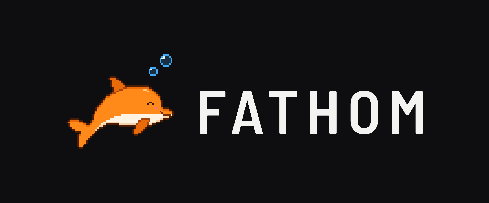
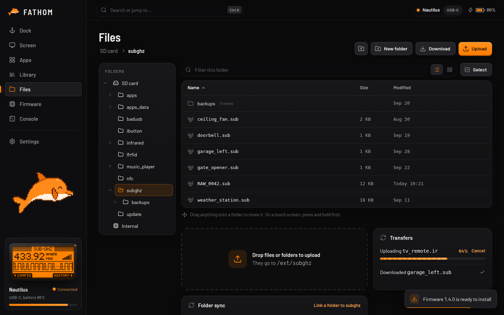
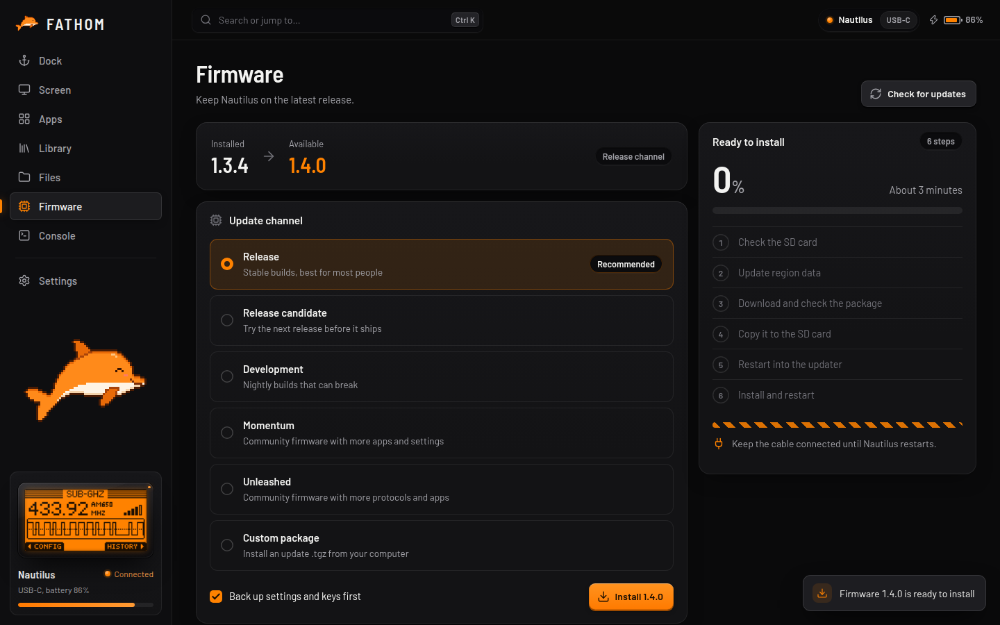

<p align="center">
  
</p>

<p align="center">
  <a href="https://github.com/Le-Oreo/Fathom/releases"></a>
  
  <a href="https://github.com/Le-Oreo/Fathom/blob/main/LICENSE"></a>
  <a href="https://github.com/Le-Oreo/Fathom/wiki"></a>
</p>

A desktop companion app for the **Flipper Zero**, in the same family as qFlipper and Flipper Lab. It mirrors and controls the Flipper's screen, manages its files, keeps a library of your saved signals, opens apps, installs firmware (official, Momentum, Unleashed and more), backs up and restores, and has a real command-line console. A pixel dolphin lives in the sidebar and reacts to what you do.

Built with [Tauri 2](https://tauri.app) (Rust) and React + TypeScript. Windows, macOS and Linux.

> FATHOM is an independent project. It isn't made by, endorsed by or affiliated with Flipper Devices Inc. "Flipper Zero" is their trademark.


## Features

**Connect.** Plug the Flipper in over USB-C, or turn on **Bluetooth** in Settings and use it unplugged (pair it in your computer's Bluetooth settings first; everything but the Console works over the air). FATHOM finds it and connects, with plain-language errors when something's wrong (a charge-only cable, another app holding the port, a missing Linux udev rule). Several Flippers? Switch between them from the connection pill; each one is remembered.

**Live screen.** The Flipper's screen, mirrored live, with its keys under it (tap or hold, keyboard shortcuts too). Take screenshots, record GIFs, and **type text into the Flipper's own on-screen keyboard** from your computer.


**Files.** A real file manager for the SD card and internal storage: list and grid views, sorting, filter, multi-select, drag to move, rename, delete, new folder, a text editor in the details drawer. Upload files _and whole folders_ by drag and drop, download files and folders, with a transfer queue you can cancel and retry. Files already on the Flipper unchanged are skipped, so a stopped upload carries on where it left off. **Folder sync** keeps a folder on your computer mirrored onto the Flipper, showing you every change first.



**Library.** Every saved Sub-GHz, Infrared, NFC, RFID, iButton and Bad USB file, with its descriptive details (frequency, protocol, type), favourites and tags. Open one on the Flipper in a click.

**Apps.** Open the Flipper's built-in apps, and list, open and remove the apps installed on the SD card.

**Firmware.** Install the official Release, Release candidate or Development builds, or **Momentum**, **Unleashed** or any firmware published as GitHub releases, straight from its makers. FATHOM follows qFlipper's update sequence: it checks the SD card, refreshes the region data, downloads and checks the package, copies only what isn't on the card yet, and waits for the Flipper to finish. Pull the cable halfway and Retry carries on. You can also install an update `.tgz` from your computer. On community firmware, FATHOM tells you when its makers have a newer release.



**Backups.** Back up the Flipper's internal storage (in qFlipper's format) and, if you like, the whole SD card, where later backups copy only what changed. Restore never deletes anything on the SD card.

**Console.** The Flipper's command line in a real terminal (xterm.js), with colours, history (Up and Down, kept between runs) and your own saved commands.

**And:** a yellow banner at the top when a newer FATHOM is out, sets the Flipper's clock when it connects, remembers the window size, accent colours, holiday app icons, a command palette (Ctrl/Cmd+K), number keys to switch pages, rotating logs and a Copy diagnostics button for getting help.

## Install

Download the installer for your system from [**Releases**](https://github.com/Le-Oreo/fathom/releases). Builds of the latest code are also in the **Actions** tab: open the latest **FATHOM installers** run and pick the file under **Artifacts** (you need to be signed in to GitHub for those).

| System               | Artifact                     | File                              |
| -------------------- | ---------------------------- | --------------------------------- |
| Windows              | `FATHOM-windows`             | the `-setup.exe`                  |
| macOS, Apple Silicon | `FATHOM-macos-apple-silicon` | the `.dmg`                        |
| macOS, Intel         | `FATHOM-macos-intel`         | the `.dmg`                        |
| Linux                | `FATHOM-linux`               | the `.AppImage`, `.deb` or `.rpm` |

The builds aren't code-signed yet, so Windows SmartScreen and macOS Gatekeeper ask before the first launch (Windows: _More info → Run anyway_; macOS: right-click the app → _Open_).

**Linux:** the `.deb` and `.rpm` add a udev rule so you can open the Flipper's port without root. With the AppImage, FATHOM's Connect page shows the one-time commands if it's needed.

Quit qFlipper and close Flipper Lab before using FATHOM: only one app can use the Flipper's USB port at a time.

## Build from source

You need [Rust](https://rustup.rs), [Node.js](https://nodejs.org) 22+, and the [Tauri prerequisites](https://v2.tauri.app/start/prerequisites/) for your system (on Linux also `libudev-dev`).

```sh
git clone --recurse-submodules https://github.com/Le-Oreo/fathom.git
cd fathom
npm ci
npm run tauri dev        # run it
npm run tauri build      # make an installer for this computer
```

Forgot `--recurse-submodules`? Run `git submodule update --init` (FATHOM needs Flipper's protobuf definitions in `src-tauri/proto`).

`npm run dev` runs the interface in a browser with a pretend Flipper, no hardware needed.

## How it works

```
React UI (src/)                       Rust core (src-tauri/)
  views/  components/  state/           transport/  USB serial and Bluetooth
  device/api.ts  <- the only way in     rpc/        CLI-to-RPC switch, varint framing, replies by command_id
     mock.ts  (pretend Flipper)         services/   device, screen, storage, library, apps,
     tauri.ts (the real one)  --invoke-->           firmware, backup, sync
```

FATHOM speaks the Flipper's protobuf RPC over USB serial, as qFlipper does. The UI never touches the device directly: everything goes through `src/device/api.ts`, which has a real implementation and a pretend one that behave the same.

## Privacy

No telemetry, no accounts. FATHOM only goes online to check for and download firmware and region data (Flipper's update server, `update.flipperzero.one`, and for other firmware its makers' GitHub releases) and to see whether a newer FATHOM is out (this repository's GitHub releases). Logs stay on your computer and leave out your Flipper's name, its identifiers and your file paths.

## Firmware and the law

Installing firmware is at your own risk; keep a backup (FATHOM can make one first). Community firmware may unlock radio features that your local rules don't allow. What you transmit, and where, is your responsibility.

## License

FATHOM is released under the [MIT License](LICENSE).

It uses:

- [Barlow](https://github.com/jpt/barlow) and Barlow Semi Condensed fonts, SIL Open Font License 1.1
- [Lucide](https://lucide.dev) icons, ISC License
- [xterm.js](https://xtermjs.org), [React](https://react.dev), [Tauri](https://tauri.app), [zustand](https://github.com/pmndrs/zustand), [gifenc](https://github.com/mattdesl/gifenc) and many Rust crates, MIT or Apache-2.0
- Flipper's [flipperzero-protobuf](https://github.com/flipperdevices/flipperzero-protobuf) definitions (a git submodule, used to generate the protocol code)

The pixel dolphin is FATHOM's own, not Flipper's.
