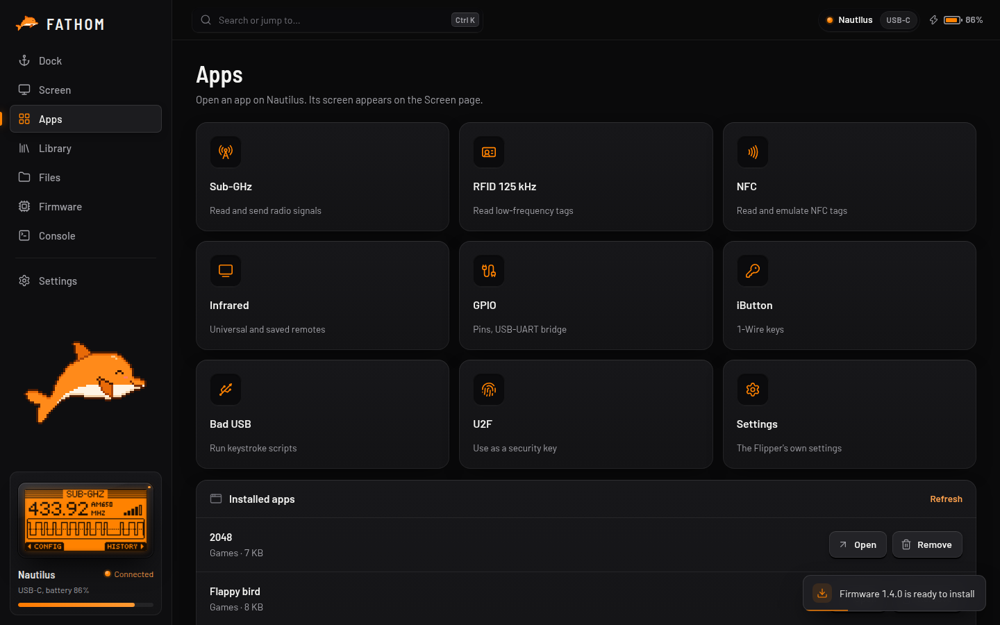

# Apps

## Built-in apps

Open any of the Flipper's built-in apps (Sub-GHz, RFID, NFC, Infrared, GPIO, iButton, Bad USB, U2F and more) on the Flipper with one click. If your firmware doesn't have an app, FATHOM hides it.

## Installed apps

FATHOM lists the apps installed on the SD card (`.fap` files in `/ext/apps`), grouped by category. You can **open** them on the Flipper or **remove** them (it asks first).

> [!TIP]
> If an installed app won't start after a firmware update, it may have been built for the old firmware. Get the version made for your new firmware.
