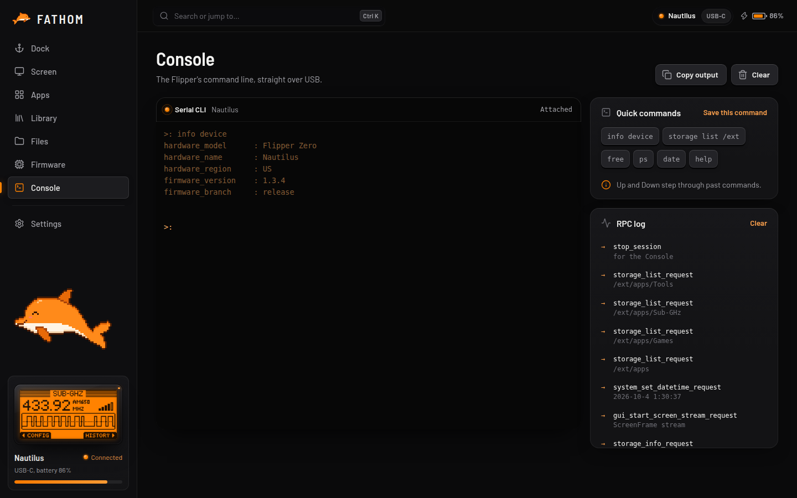

# Console

The Flipper's own command line, in a real terminal.

- Type commands just like in a terminal. Try `help`, `info device`, `storage list /ext`, `free`, `ps` or `date`.
- **Up** and **Down** step through your past commands, and history is kept between runs.
- **Quick commands** run with one click. Type a command and click **Save this command** to add your own.
- **Copy output** copies everything in the terminal. **Clear** empties it.
- The **RPC log** on the right shows every request FATHOM sends to the Flipper, which is handy for curious people and bug reports. Turn it off under *Settings → Console*.

Good to know:
- While the Console is open it has the Flipper's command line to itself, so the live screen and file transfers pause. Leave the Console page and everything else picks up again.
- The Console needs the **USB cable**. It isn't available over Bluetooth.
