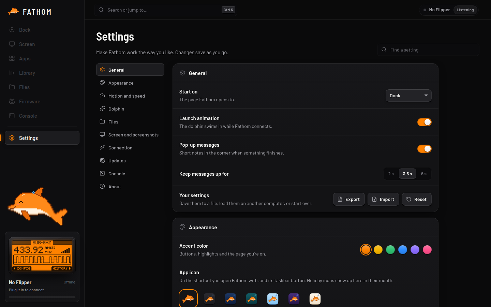

# Getting started

This takes about a minute.

## 1. Plug in your Flipper

Connect the Flipper with a **USB-C data cable** and make sure it's switched on and unlocked. Open FATHOM.

FATHOM finds the Flipper on its own and connects. You'll see your Flipper's name at the top right and the **[Dock](Dock)** opens.

> [!TIP]
> Nothing happening? Some USB-C cables only carry power. Try another cable, and see **[Troubleshooting](Troubleshooting)**.

## 2. Look around

The sidebar on the left takes you everywhere. Press the number keys **1** to **8** to jump between pages:

| Key | Page | What it's for |
| :-: | --- | --- |
| **1** | [Dock](Dock) | Battery, storage, firmware and quick actions at a glance |
| **2** | [Screen](Live-Screen) | The Flipper's screen, live, with its buttons |
| **3** | [Apps](Apps) | Open built-in apps and manage installed ones |
| **4** | [Library](Library) | Everything you've saved, sorted by type |
| **5** | [Files](Files) | The SD card and internal storage |
| **6** | [Firmware](Firmware) | Updates, other firmware and backups |
| **7** | [Console](Console) | The Flipper's command line |
| **8** | [Settings](Settings) | Make FATHOM work the way you like |

Press **Ctrl K** (**⌘ K** on a Mac) anywhere to search for a page, a file or an action.

## 3. Make a first backup

Before you change anything, it's worth backing up. On the **Dock**, click **Back up**. FATHOM saves the Flipper's settings and keys to your computer, and the whole SD card too if you tick the box. See **[Backups](Backups)**.

## 4. Check for a firmware update

If a newer official firmware is out, the Dock shows an **Update** button. Click it to install, or open **[Firmware](Firmware)** to choose a different version, including Momentum and Unleashed.

## Next steps

- Control the Flipper from your keyboard on the **[Screen](Live-Screen)** page.
- Drag a folder onto **[Files](Files)** to copy it to the SD card.
- Connect over **[Bluetooth](Connecting#bluetooth)** so you can leave the cable at home.
