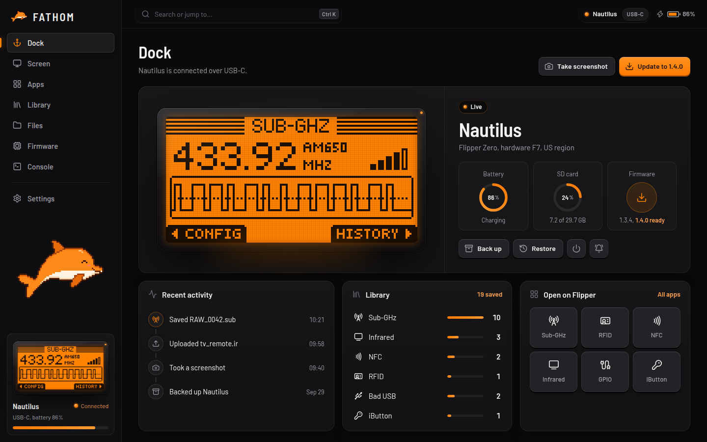

  

<h3 align="center">A free, open-source desktop app for the Flipper Zero</h3>

  
  
  

  <a href="Installation"><b>Install</b></a> &nbsp;·&nbsp;
  <a href="Getting-Started"><b>Getting started</b></a> &nbsp;·&nbsp;
  <a href="Troubleshooting"><b>Troubleshooting</b></a> &nbsp;·&nbsp;
  <a href="FAQ"><b>FAQ</b></a>

 

  

## What is FATHOM?

FATHOM is a desktop companion for your Flipper Zero, in the same spirit as qFlipper but with a lot more in it. Plug your Flipper in (or connect over Bluetooth) and you can watch and control its screen, manage every file on it, browse everything you've saved, install firmware, back it up, and use its command line, all from one window.

It's **free**, **open source** (MIT) and has **no accounts and no tracking**.

## What it can do

<table>
  <tr>
    <td width="50%" valign="top">
      <h4><a href="Live-Screen">Live screen</a></h4>
      See the Flipper's screen live, control it with your keyboard, take screenshots, record GIFs and type text into the Flipper's keyboard from your computer.
    </td>
    <td width="50%" valign="top">
      <h4><a href="Files">Files</a></h4>
      A real file manager for the SD card and internal storage. Drag and drop whole folders, download anything, edit text files and keep a folder in sync.
    </td>
  </tr>
  <tr>
    <td valign="top">
      <h4><a href="Library">Library</a></h4>
      Every saved Sub-GHz, Infrared, NFC, RFID, iButton and Bad USB file in one place, with favourites and tags. Open any of them on the Flipper in a click.
    </td>
    <td valign="top">
      <h4><a href="Firmware">Firmware</a></h4>
      Install official releases, or Momentum, Unleashed and other community firmware straight from their makers. A pulled cable never leaves it half-done.
    </td>
  </tr>
  <tr>
    <td valign="top">
      <h4><a href="Backups">Backups</a></h4>
      Back up the Flipper's settings and keys, and the whole SD card if you like. Restoring never deletes anything on the card.
    </td>
    <td valign="top">
      <h4><a href="Console">Console</a></h4>
      The Flipper's command line in a real terminal, with colours, history and your own saved commands.
    </td>
  </tr>
  <tr>
    <td valign="top">
      <h4><a href="Apps">Apps</a></h4>
      Open the built-in apps on the Flipper, and see, open and remove the apps installed on its SD card.
    </td>
    <td valign="top">
      <h4><a href="Connecting">Connecting</a></h4>
      USB-C or Bluetooth, several Flippers at once, and automatic reconnects when the Flipper restarts.
    </td>
  </tr>
</table>

## Where to start

| I want to… | Go to |
| --- | --- |
| Download and install FATHOM | **[Installation](Installation)** |
| Connect my Flipper for the first time | **[Getting started](Getting-Started)** |
| Update or change my Flipper's firmware | **[Firmware](Firmware)** |
| Learn the keyboard shortcuts | **[Keyboard shortcuts](Keyboard-Shortcuts)** |
| Fix a connection problem | **[Troubleshooting](Troubleshooting)** |
| Build FATHOM myself | **[Building from source](Building-from-Source)** |

> [!NOTE]
> FATHOM is an independent project. It isn't made by or affiliated with Flipper Devices.
