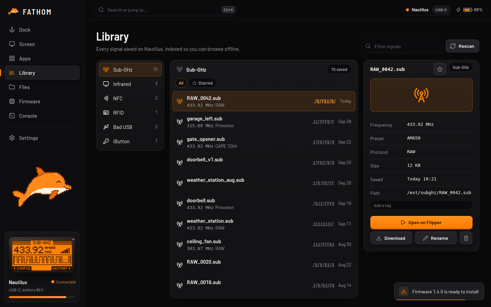

# Library

The Library collects everything you've saved on the Flipper, sorted by type, so you don't have to dig through folders.

## What's in it

FATHOM looks through the SD card for saved **Sub-GHz**, **Infrared**, **NFC**, **RFID (125 kHz)**, **iButton** and **Bad USB** files and lists them with their useful details, like frequency, preset, protocol and the number of buttons on a remote.

The Library only shows descriptive details. It never shows key data or raw recordings.

## Finding things

- Pick a type on the left, or **filter** by name.
- Click the star to make something a **favourite**.
- Add your own **tags**, like *home*, *car* or *TV*, to group things your way.

## Using a saved file

Click **Open on Flipper** and the Flipper opens that file in the right app, ready to use.
