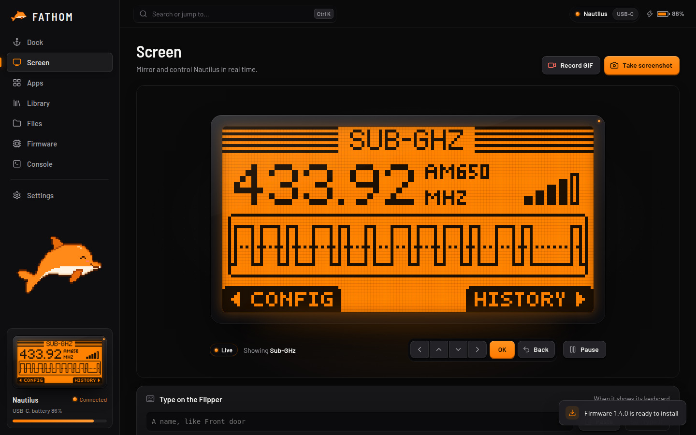

# Live screen

The **Screen** page shows the Flipper's screen live, large and sharp, with its buttons underneath.

## Controlling the Flipper

Click the buttons under the screen, or use your keyboard:

| Key | Flipper button |
| --- | --- |
| **↑ ↓ ← →** | Up, Down, Left, Right |
| **Enter** | OK |
| **Esc** or **Backspace** | Back |

Hold a key to hold the button, just like on the Flipper (long presses work too). Click the screen first if the keys don't respond. You can turn keyboard control off under *Settings → Screen and screenshots*.

## Screenshots and GIFs

- **Take screenshot** saves a PNG of the screen. Choose the colours (orange like the real screen, black on white, or ink on paper) and the size (2×, 4× or 8×) in Settings.
- **Record GIF** records the screen until you press **Stop**, then saves an animated GIF. It's great for showing off an app or reporting a bug.

Your screenshots show up in a strip on the page so you can find them again.

## Typing on the Flipper

Naming a file on the Flipper's tiny keyboard is slow. When the Flipper shows its keyboard (for example when saving a signal), type the name into **Type on the Flipper** in FATHOM and click **Type it**. FATHOM clears the box on the Flipper and presses the keys for you, checking the screen after every letter.

## Frame rate and battery

The live screen runs at 15 frames per second by default. Choose 30 for smoother motion, or 5 to save the Flipper's battery, under *Settings → Motion and speed*. By default it also pauses while FATHOM isn't the window you're using.
