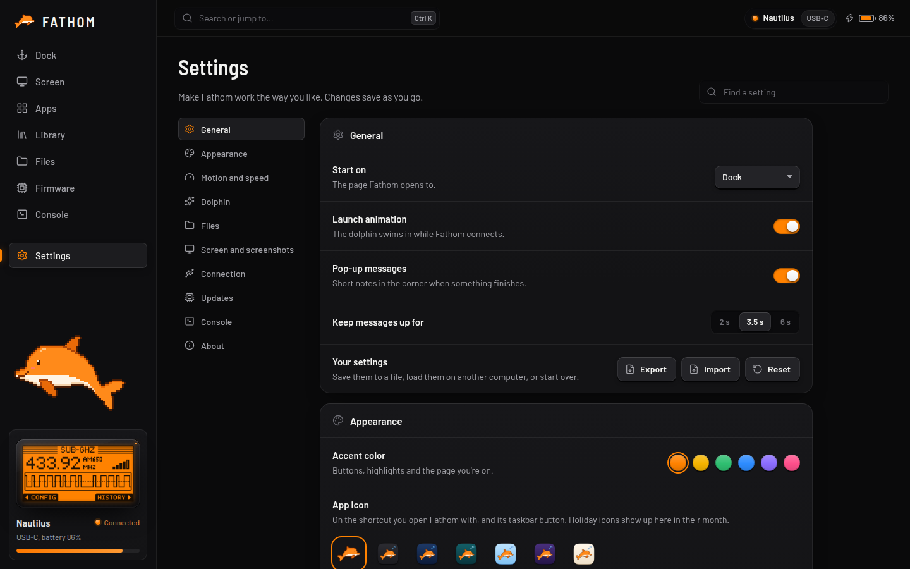

# Settings

Changes save as you go. Use the search box at the top to find a setting fast. **Export** and **Import** move your settings to another computer, and **Reset** starts over.

| Section | What you can change |
| --- | --- |
| **General** | The page FATHOM opens on, the launch animation, and pop-up messages |
| **Appearance** | Accent colour, app icon (including holiday icons), density, the screen's colours, pixel grid and glow, and the small screen in the sidebar |
| **Motion and speed** | Animations, the live screen's frame rate, and pausing it in the background |
| **Dolphin** | Show the dolphin, its size and personality, and whether it reacts to what you do, follows your pointer and does tricks |
| **Files** | One click or double-click to open, drag to move, list or grid, sort order, folders first, hidden files |
| **Screen and screenshots** | Keyboard control of the Flipper, screenshot colours and size |
| **Connection** | Connect automatically, set the Flipper's clock, and use Bluetooth when unplugged |
| **Updates** | Back up before firmware updates, check for updates at launch |
| **Console** | The RPC log and the console text size |
| **About** | FATHOM's version, licences, **Copy diagnostics** for getting help, and replaying the launch animation |
